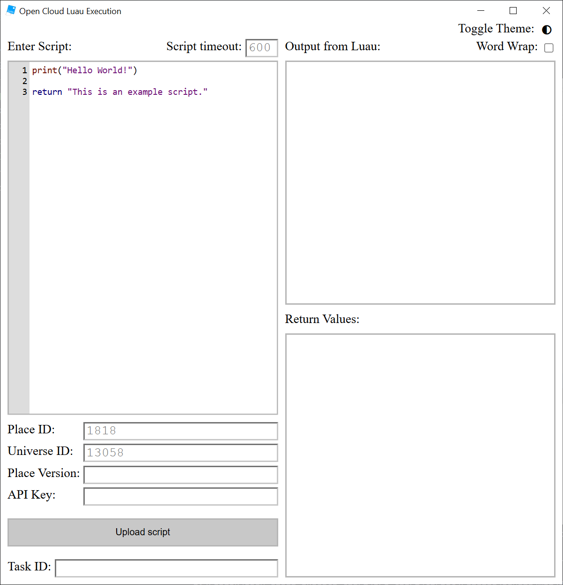

# Open Cloud Execute GUI

A Tauri-based app for running scripts using Roblox's Open Cloud Luau execution API. Hopefully self-explanatory once you give it a try.

You do not need to specify a place version; it will run on latest if none is given.

## Why not a website?

The initial iteration of this app was a website! It could not stay a website because Roblox's API endpoints do not support CORS, so sending requests from the browser was not an option. The potential for using a server as some kind of proxy was considered, but due to the way Roblox ratelimits these APIs (per IP address), that isn't sustainable.

If in the future Roblox reconsiders how they do ratelimiting, this will be deployed as a website as well. As it stands, this is your best option.

## Building

Install Rust and NPM. Run `npm install` in the repo and then run `npm run tauri build`. After Vite and Cargo finish building, the bundled program will be in `src-tauri/target/release`.
